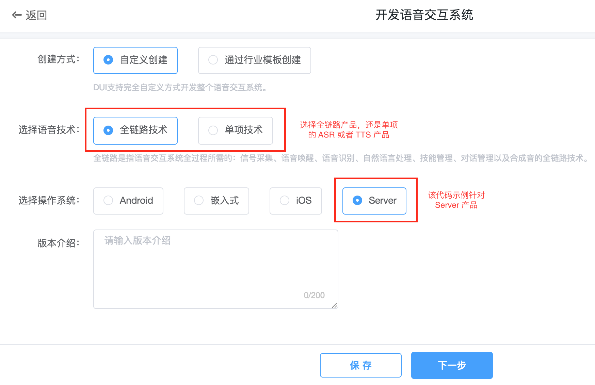
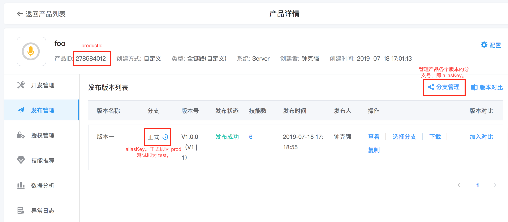
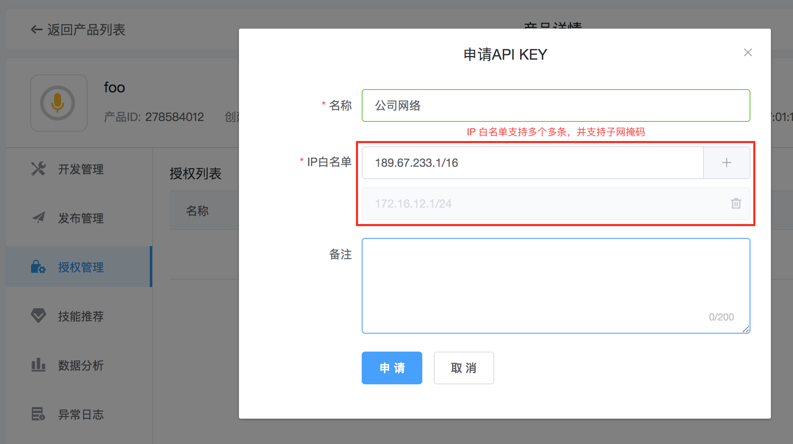
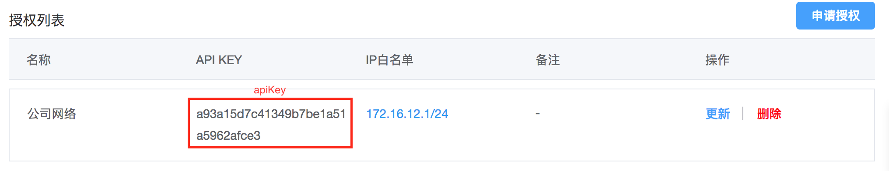
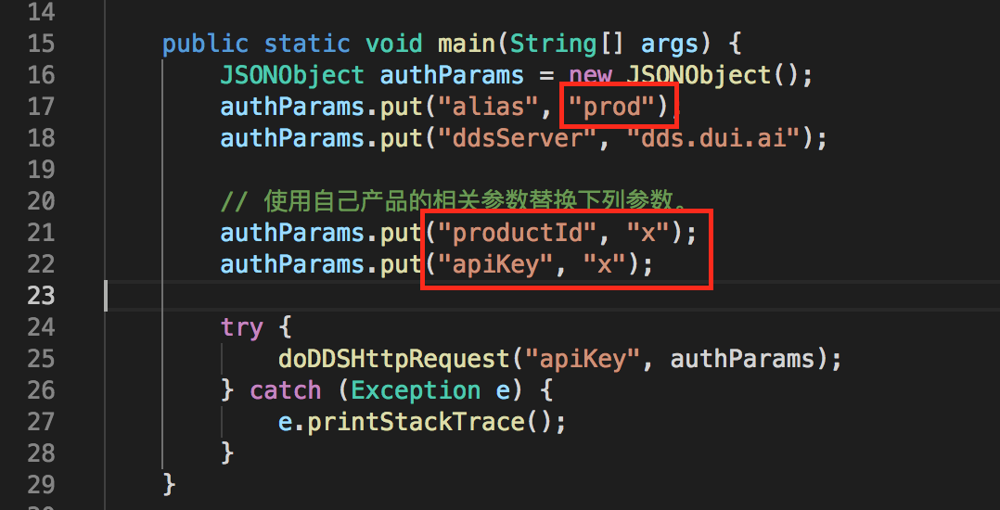

# dui-dds-server-api-samples

## 示例代码说明

示例代码分为三类：

1. 全链路产品 Server 接入代码示例。

    * dds-http-java --- 全链路产品基于 http 协议接口 Java 代码示例。
    * dds-http-python --- 全链路产品基于 http 协议接口 Python 代码示例。
    * dds-websocket-java --- 全链路产品基于 websocket 协议接口 Java 代码示例。
    * dds-websocket-python --- 全链路产品基于 websocket 协议接口 Python 代码示例。

2. 在线语音识别 Server 接入代码示例。

    * asr-http-java --- 在线语音识别基于 http 协议接口 Java 代码示例。
    * asr-websocket-java --- 在线语音识别基于 websocket 协议接口 Java 代码示例。

3. 在线语音合成 Server 接入代码示例。

    * tts-http-java --- 在线语音合成基于 http 协议接口 Java 代码示例。

## 使用说明

代码示例不能直接运行，需要替换其中产品相关的参数。所以需要开发者首先在 DUI 控制台创建产品。

产品创建完成后，根据下图可获取该产品的 productId 和 aliasKey。

进入产品授权管理页面获取 apiKey。

获取 apiKey 需要设置访问机器的 IP 白名单。可以填写子网掩码长度模糊匹配网段。

完成上述操作后，我们就得到了产品的 productId, aliasKey 和 apiKey。用这些参数替换掉下述代码中各个参数的位置，即可完成请求。

> 每个代码示例中基本都有此三个参数。（单项技术产品中不包含 aliasKey 参数）

## FAQ

1. 运行代码示例返回 401 Unauthorized，是什么原因？

通常是 apiKey 参数不正确，也可能是运行代码示例的机器外网 IP 不在申请 apiKey 时填写的 IP 白名单中。请确认机器的外网 IP。

2. 我不知道自己机器的外网 IP，怎么办？

可以在百度输入 IP，可以查询到自己机器在外网的 IP。如果是 Linux 或者 macOSX 的系统，或者没有 GUI 的服务器，可以使用 `curl myip.ipip.net` 这个指令获取到自身的外网 IP。
